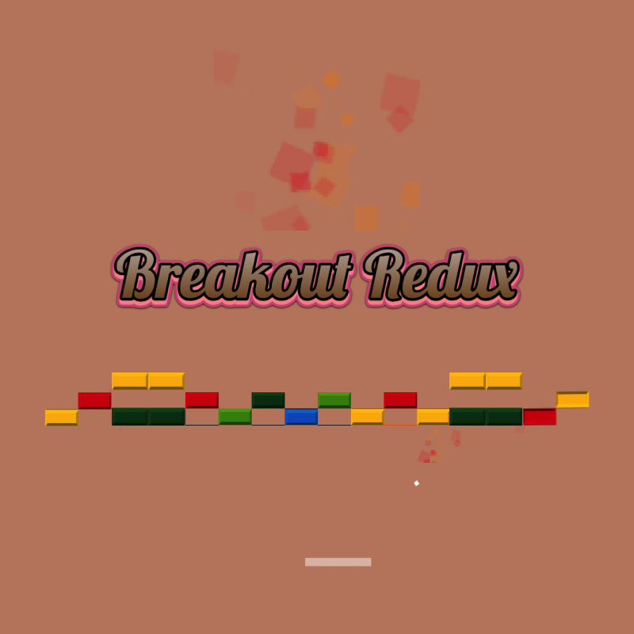

## Breakout Redux - Brick-Breaking Bliss

Prepare to embark on a nostalgic journey into the world of classic arcade gaming, with a contemporary twist! Breakout Redux is a captivating 2D game that pays homage to the beloved classic, Breakout, while introducing innovative game modes that will challenge your skills, reaction time, and strategic thinking.

- Classic Mode: In this timeless mode, it's just you, the paddle, and the bouncing ball. Your mission is simple: obliterate every brick in your path with precision and skill. Each well-aimed hit results in the satisfying destruction of a brick, bringing you one step closer to victory.

- Dynamic Mode: Brace yourself for an adrenaline-packed experience in Dynamic Mode! Here, the pressure is on as bricks descend every 10 seconds, demanding swift action. But it's not just about survival – it's about thriving. Catch colorful bonuses falling from the sky: extra scores, increased paddle size, and even mighty power-ups. Be cautious, though, as some bonuses can be a double-edged sword. You'll need to remember which color corresponds to which bonus for a strategic advantage. Encounter blocks with varying strengths, adding an extra layer of challenge to this heart-pounding mode. Watch your ball grow redder as it gains strength, making it a formidable force against the bricks.

- Modern Mode: In Modern Mode, the bricks are no longer your primary concern – they're stationary. Instead, focus on mastering the art of bonus collection. Enjoy all the bonuses from Dynamic Mode, and unlock even more thrilling power-ups, including the exhilarating Double Balls and Triple Balls. With Extra Balls at your disposal, the screen fills with bouncing spheres, and the mayhem intensifies. Gain temporary respite with the Extra Wall bonus, which temporarily shields you from the impending brick downfall.

- Bonus Mode: Feel like a gaming deity in Bonus Mode. Your paddle wields an incredible strength of 9, offering an awe-inspiring god-mode gameplay experience. Race against the clock to clear the bricks within 30 seconds – no extra lives, just pure skill and strategy. It's an intense challenge that will leave you exhilarated.

Unlock and Progress: Every second level presents an opportunity to earn even more points in a bonus round. As you progress through Breakout Redux, you'll unlock levels one by one, with each victory bringing you closer to arcade greatness.

Boost Your Game: Need a helping hand? You can double your wins by watching short ads or secure an extra life when things get tough. Just remember, there's a 30-second cooldown between requests.

Retro Visuals: Immerse yourself in nostalgia with the old TV shader visual effect. Relive the golden age of gaming with a visual style that takes you back in time.

Experience the evolution of Breakout like never before. Breakout Redux combines classic gameplay with innovative modes and dazzling visuals, ensuring hours of entertainment and an unforgettable journey through the arcade ages. Can you break all the bricks and become the ultimate Breakout champion? Get ready to find out!




### Running

```bash
# Install dependencies
npm install
# For pre-commit hooks, run once
npm install husky

# Build
npm run build:github # For GitHub Pages
npm run build:crazy # For Crazy Games
npm run build:itch # For Itch.io

# Run development server
npm run dev

# Run preview server
npm run preview

# format code
npm run format
```


### Workflow actions

Once it is cloned make sure you enable permissions

`Settings > Actions > General` make sure in **Workflow permissions** **Read and Write** is granted


### How to deploy to GitHub Pages?

Just create a new release

1. Navigate to **Releases**
2. Click **Choose a tag**
3. Type your tag name similarly to `v1.0.0` (increment the last version)
4. Click **create new tag** (plus button)
5. Click **Publish release**

Pipeline is going to run and deploy the application
